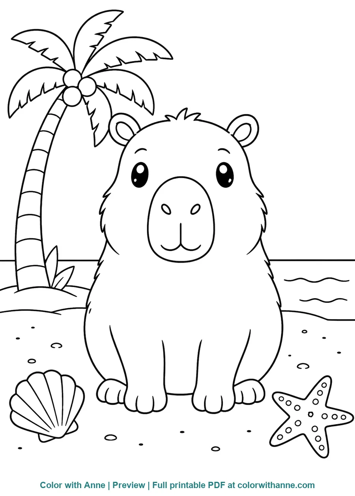
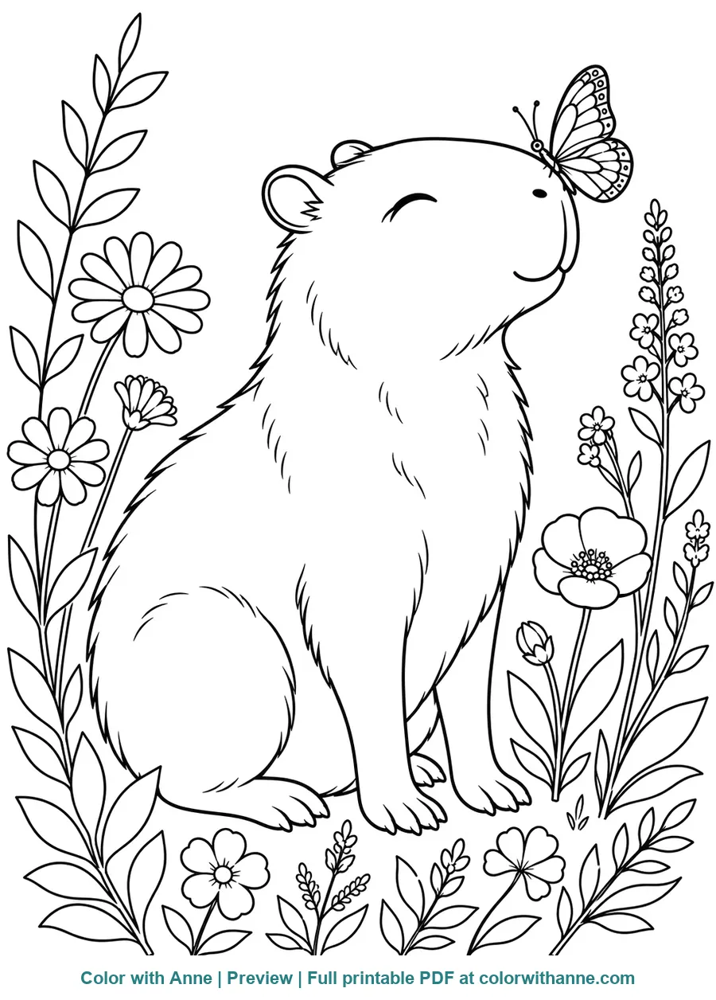
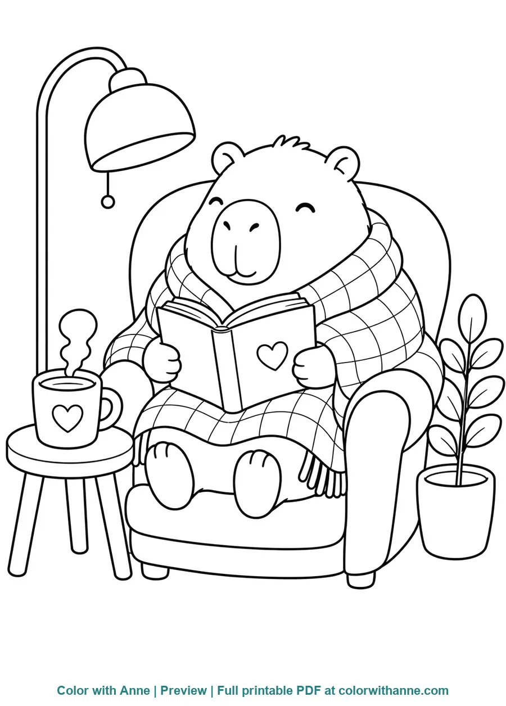

# Color with Anne: Free Printable Coloring Pages

[Color with Anne](https://colorwithanne.com/) is a growing library of free
printable coloring pages for children, parents, teachers, and anyone who enjoys
a quiet creative activity. The website brings together animal, holiday,
popular-interest, and everyday themes with clear previews and easy access to
printable PDF pages.

This repository is the official lightweight preview catalog for the website.
It documents selected collections, recent additions, accessible image
descriptions, and reusable metadata without duplicating the print-quality PDF
library.

[Explore Color with Anne](https://colorwithanne.com/) |
[Browse the preview catalog](https://imakingtan.github.io/color-with-anne-printable-coloring-pages/)

## About Color with Anne

Color with Anne is designed to help visitors:

- Find themed coloring activities for home, classrooms, parties, and quiet time.
- Preview a drawing before choosing what to print.
- Explore both simple scenes and more detailed compositions.
- Print on standard US Letter or A4 paper from the official topic pages.

The maintained website is the authoritative source for downloadable files,
usage guidance, and the newest coloring-page collections.

## New This Week

_Last updated: October 9, 2026_

- [20 South Park Coloring Pages (Free PDF Printables)](https://colorwithanne.com/south-park-coloring-pages/)
- [24 December Coloring Pages (Free PDF Printables)](https://colorwithanne.com/december-coloring-pages/)
- [17 Flower Mandala Coloring Pages (Free PDF Printables)](https://colorwithanne.com/flower-mandala-coloring-pages/)
- [20 Bugatti Coloring Pages (Free PDF Printables)](https://colorwithanne.com/bugatti-coloring-pages/)

These links point to the newest topic pages on Color with Anne. Their images and
printable files remain on the official website rather than being copied into
this repository.

## Trending Now

_What visitors are searching for this week. Every link goes to a real article
on colorwithanne.com._

- [Rumi Coloring Pages (Free PDF Printables)](https://colorwithanne.com/rumi-coloring-pages/) — searches for "rumi coloring page" surged from zero to hundreds of impressions
- [KPop Demon Hunters Coloring Pages (Free PDF Printables)](https://colorwithanne.com/kpop-demon-hunters-coloring-pages/) — rising fast in site searches and reader requests
- [Halloween Coloring Pages (Free PDF Printables)](https://colorwithanne.com/halloween-coloring-pages/) — seasonal favorite as October 31 approaches
- [Cinnamoroll Coloring Pages (Free PDF Printables)](https://colorwithanne.com/cinnamoroll-coloring-pages/) — clicks up sharply this month

## Featured preview collection: Capybara

The first complete preview theme in this repository is **Capybara Coloring
Pages**, with ten original scenes built around everyday activities, nature,
celebrations, and calm moments.

[View the Capybara preview gallery](https://imakingtan.github.io/color-with-anne-printable-coloring-pages/#sheets) |
[Get the official printable PDFs](https://colorwithanne.com/capybara-coloring-pages/)

<p align="center">
  
  
  
</p>

The ten scenes are Beach Day, Birthday Party, Bubble Bath Spa, Butterfly
Garden, Hot Springs, Listening to Music, Plant Care, Pond with Ducks, Rainy Day
Umbrella, and Cozy Reading.

## Why this repository uses previews

This project deliberately publishes branded, web-sized WebP previews rather
than duplicate PDF files. This keeps the repository quick to browse and
preserves the official Color with Anne topic page as the single source for
print-quality downloads.

Each preview is approximately 900 pixels wide. For clean A4 or US Letter
printing, use the PDFs linked from the official topic page.

The published gallery consists of static HTML and CSS and loads no analytics or
trackers.

## Repository structure

```text
.
|-- catalog/
|   `-- coloring-pages.json
|-- docs/
|   |-- assets/coloring-pages/capybara/
|   |-- index.html
|   |-- print-guide.html
|   `-- styles.css
|-- schema/
|   `-- coloring-page.schema.json
|-- ARTWORK-LICENSE.md
|-- CONTRIBUTING.md
`-- LICENSE
```

## Metadata format

Each catalog entry describes a scene without relying on its file name alone.
The fields cover theme, subject, preview path, accessibility text, official
source page, and licensing.

Validate or adapt the format using
[`schema/coloring-page.schema.json`](schema/coloring-page.schema.json). The
schema is designed as a practical starting point rather than a formal industry
standard.

## Use and attribution

- Source code and technical documentation: [MIT License](LICENSE)
- Coloring artwork and preview images: [Color with Anne artwork license](ARTWORK-LICENSE.md)

The artwork may be printed for personal and classroom non-commercial use. It
may not be sold, republished as a collection, or used to populate another
website.

## Project principles

1. Useful to people before search engines.
2. Original, family-friendly artwork with clear ownership.
3. Fast pages with no advertising, analytics, accounts, or trackers.
4. Descriptive titles and alt text rather than keyword repetition.
5. Reviewed previews instead of duplicated print-quality files.

## More coloring activities

Browse the maintained printable collection at
[colorwithanne.com](https://colorwithanne.com/), or go directly to the
[official Capybara coloring pages](https://colorwithanne.com/capybara-coloring-pages/).
